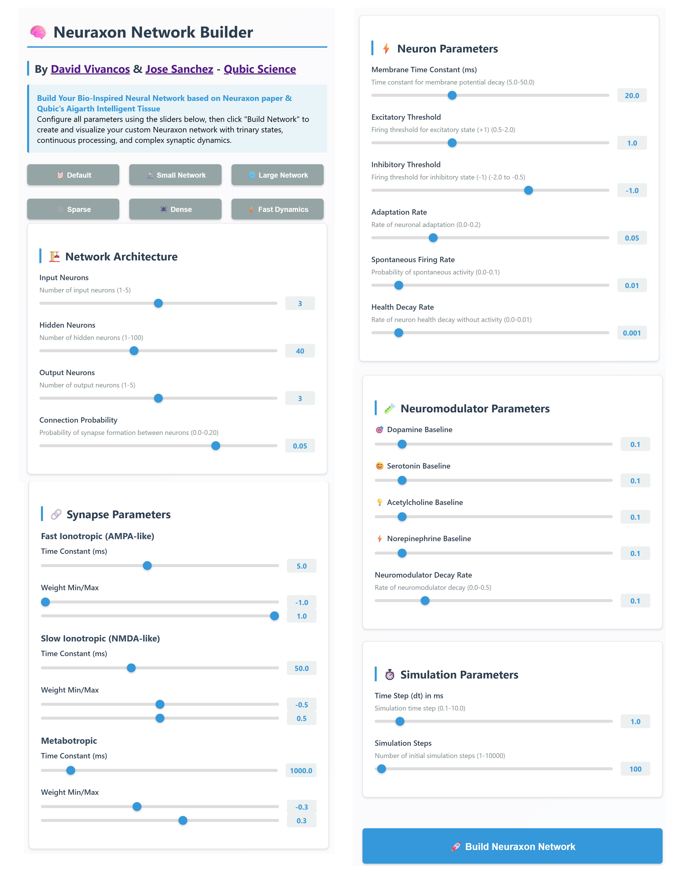

# Neuraxon

<div align="center">
<a href="https://www.python.org/"></a>
<a href="https://opensource.org/licenses/MIT"></a>
<a href="https://huggingface.co/spaces/DavidVivancos/Neuraxon"></a>
<a href="https://www.researchgate.net/publication/397331336_Neuraxon"></a>
<a href="https://github.com/DavidVivancos/Neuraxon"></a>
</div>

Experience Neuraxon's trinary neural dynamics with our **interactive 3D visualization** at [HuggingFace Spaces](https://huggingface.co/spaces/DavidVivancos/Neuraxon).

### Demo Features:
- 🧠 **Build Custom Networks**: Configure neurons, synapses, and plasticity parameters
- 🎯 **Interactive Controls**: Manually set input neuron states (excitatory/neutral/inhibitory)
- 🔬 **Live Neuromodulation**: Adjust dopamine 🎯, serotonin 😊, acetylcholine 💡, and norepinephrine ⚡ in real-time
- 📊 **3D Visualization**: Watch neural activity flow through the network with curved synaptic connections
- ⚙️ **Preset Configurations**: Try small networks, large networks, high plasticity modes, and more
- ▶️ **Real-time Simulation**: Run continuous processing and observe emergent dynamics

No installation required—just open your browser and explore!

## 📸 Demo Screenshots

<div align="center">
  
  
  <p><i>Interactive 3D visualization showing neural activity and neuromodulator flow</i></p>
</div>

<hr />

## 👋 Overview

**Neuraxon** is a bio-inspired neural network framework that extends beyond traditional perceptrons through **trinary logic** (-1, 0, 1), capturing excitatory, neutral, and inhibitory dynamics found in biological neurons.

Unlike conventional neural networks that use discrete time steps and binary activation, Neuraxon features:
- **Continuous processing** where inputs flow as constant streams
- **Multi-timescale computation** at both neuron and synapse levels
- **Dynamic plasticity** with synaptic formation, collapse, and rare neuron death
- **Neuromodulation** inspired by dopamine, serotonin, acetylcholine, and norepinephrine
- **Spontaneous activity** mirroring task-irrelevant yet persistent brain processes

This implementation includes a hybridization with Qubic's **Aigarth Intelligent Tissue**, demonstrating evolutionary approaches to neural computation.

Check out our [paper](https://www.researchgate.net/publication/397331336_Neuraxon) for complete theoretical foundations and biological inspirations!

## 🧠 Key Innovations

### Trinary State Logic
Neuraxons operate in three states:
- **+1 (Excitatory)**: Active firing, promoting downstream activity
- **0 (Neutral)**: Subthreshold processing, enabling subtle modulation
- **-1 (Inhibitory)**: Active suppression of downstream activity

This third "neutral" state models:
- Metabotropic receptor activation
- Silent synapses that can be "unsilenced"
- Subthreshold dendritic integration
- Neuromodulatory influences

### Multi-Component Synapses
Each synapse maintains three dynamic weights:

```python
w_fast   # Ionotropic (AMPA-like), τ ~5ms - rapid signaling
w_slow   # NMDA-like, τ ~50ms - sustained integration  
w_meta   # Metabotropic, τ ~1000ms - long-term modulation
```

### Continuous Time Processing
Unlike discrete time-step models, Neuraxon processes information continuously:

```
τ (ds/dt) = -s + Σ w_i·f(s_i) + I_ext(t)
```

This enables:
- Real-time adaptation to streaming inputs
- Natural temporal pattern recognition
- Biologically plausible dynamics

## 🚀 Quick Start

### Installation

```bash
git clone https://github.com/DavidVivancos/Neuraxon.git
cd Neuraxon
pip install -r requirements.txt
```

### Basic Usage

```python
from neuraxon import NeuraxonNetwork, NetworkParameters

# Create network with default biologically-plausible parameters
params = NetworkParameters(
    num_input_neurons=5,
    num_hidden_neurons=20,
    num_output_neurons=5
)
network = NeuraxonNetwork(params)

# Set input pattern (trinary states: -1, 0, 1)
network.set_input_states([1, -1, 0, 1, -1])

# Run continuous simulation
for step in range(100):
    network.simulate_step()
    
    if step % 20 == 0:
        outputs = network.get_output_states()
        print(f"Step {step}: Outputs = {outputs}")

# Modulate network behavior via neuromodulators
network.modulate('dopamine', 0.8)  # Enhance learning
network.modulate('serotonin', 0.6)  # Adjust plasticity

# Save network state
from neuraxon import save_network
save_network(network, "my_network.json")
```

## 📊 Network Architecture

```
Input Layer (5 neurons)
    ↓ ↑ (bidirectional ring connectivity)
Hidden Layer (20 neurons)  
    ↓ ↑ (with spontaneous activity)
Output Layer (5 neurons)

Constraints:
- Small-world connectivity (~5% connection probability)
- No output → input connections
- Dynamic topology via structural plasticity
```

## 🔬 Advanced Features

### Synaptic Plasticity

Neuraxon implements continuous weight evolution inspired by STDP:

```python
# Weights evolve based on pre/post activity and neuromodulators
# LTP: pre=1, post=1 → strengthen synapse
# LTD: pre=1, post=-1 → weaken synapse
# Neutral state provides nuanced control
```

### Structural Plasticity

```python
# Synapses can form, strengthen, weaken, or die
# Neurons can die if health drops below threshold (hidden layer only)
# Silent synapses can be "unsilenced" through correlated activity
```

### Neuromodulation

```python
# Four neuromodulators with distinct roles:
neuromodulators = {
    'dopamine': 0.1,      # Learning & reward
    'serotonin': 0.1,     # Mood & plasticity
    'acetylcholine': 0.1, # Attention & arousal
    'norepinephrine': 0.1 # Alertness & stress response
}
```

## 🎯 Use Cases

Neuraxon is particularly suited for:

- **Continuous learning systems** that adapt in real-time
- **Temporal pattern recognition** in streaming data
- **Embodied AI and robotics** requiring bio-realistic control
- **Adaptive signal processing** with non-stationary inputs
- **Cognitive modeling** of brain-like computation
- **Energy-efficient AI** leveraging sparse, event-driven processing

## 🖥️ Visualization & Tools

### Interactive Web Demo
Visit our [HuggingFace Space](https://huggingface.co/spaces/DavidVivancos/Neuraxon) for a fully interactive 3D visualization where you can:

- **Configure** all network parameters through an intuitive GUI
- **Visualize** neurons color-coded by state:
  - 🔴 Red = Excitatory (+1)
  - 🔵 Blue = Inhibitory (-1)
  - ⚪ Gray = Neutral (0)
- **Watch** neuromodulator particles (emoji sprites) flow along synaptic pathways
- **Control** input patterns and observe how they propagate through the network
- **Experiment** with different neuromodulator levels and see their effects
- **Compare** preset configurations (minimal, balanced, highly plastic, etc.)

The demo features a  3D sphere layout with curved synaptic connections and real-time particle effects representing neuromodulator dynamics.


## 📖 Configuration Parameters

All parameters have biologically plausible default ranges:

```python
@dataclass
class NetworkParameters:
    # Architecture
    num_input_neurons: int = 5         # [1, 100]
    num_hidden_neurons: int = 20       # [1, 1000]
    num_output_neurons: int = 5        # [1, 100]
    connection_probability: float = 0.05  # [0.0, 1.0]
    
    # Neuron dynamics
    membrane_time_constant: float = 20.0  # ms [5.0, 50.0]
    firing_threshold_excitatory: float = 1.0  # [0.5, 2.0]
    firing_threshold_inhibitory: float = -1.0 # [-2.0, -0.5]
    
    # Synaptic timescales
    tau_fast: float = 5.0    # ms [1.0, 10.0]
    tau_slow: float = 50.0   # ms [20.0, 100.0]
    tau_meta: float = 1000.0 # ms [500.0, 5000.0]
    
    # Plasticity
    learning_rate: float = 0.01  # [0.0, 0.1]
    stdp_window: float = 20.0    # ms [10.0, 50.0]
    
    # ... see code for complete parameter set
```

## 🧬 Aigarth Integration

This implementation hybridizes Neuraxon with [Aigarth Intelligent Tissue](https://github.com/Aigarth/aigarth-it), combining:

- **Neuraxon**: Sophisticated synaptic dynamics and continuous processing
- **Aigarth**: Evolutionary framework with mutation and natural selection

The hybrid creates "living neural tissue" that:
- Evolves structure through genetic-like mutations
- Adapts weights through synaptic plasticity
- Undergoes selection based on task performance
- Exhibits emergent complexity and self-organization

## 📚 Citation

If you use Neuraxon in your research, please cite:

```bibtex
@article{Vivancos-Sanchez-2025neuraxon,
    title={Neuraxon: A New Neural Growth \& Computation Blueprint},
    author={David Vivancos and Jose Sanchez},
    year={2025},
    journal={ResearchGate Preprint},
    institution={Artificiology Research, UNIR University, Qubic Science},
    url={https://www.researchgate.net/}
}
```

## 🤝 Contributing

We welcome contributions! Areas of interest include:

- Novel plasticity mechanisms
- Additional neuromodulator systems
- Energy efficiency optimizations
- New application domains
- Visualization tools
- Performance benchmarks

Please open an issue to discuss major changes before submitting PRs.

## 📧 Contact

**David Vivancos**  
Artificiology Research https://artificiology.com/ , Qubic https://qubic.org/ Science Advisor
Email: vivancos@vivancos.com

**Jose Sanchez**  
UNIR University  , Qubic https://qubic.org/ Science Advisor  
Email: jose.sanchezgarcia@unir.net

## 📄 License

MIT License. See `LICENSE` file for details.


## ⚠️ Important License Notice

**Core Neuraxon**: Licensed under MIT License (permissive, no restrictions)

**Aigarth Hybrid Features**: If you implement the Aigarth hybrid features described in our paper, you **MUST** comply with the [Aigarth License](THIRD_PARTY_LICENSES.md), which includes:

- ❌ **NO military use** of any kind
- ❌ **NO use by military-affiliated entities**
- ❌ **NO dual-use applications** with military potential

**See [NOTICE](NOTICE) for full details.**

The standalone Neuraxon implementation (without Aigarth integration) has no such restrictions.

## 🙏 Acknowledgments

This work builds upon decades of neuroscience research on:
- Synaptic plasticity (Bi & Poo, 1998)
- Neuromodulation (Brzosko et al., 2019)
- Spontaneous neural activity (Northoff, 2018)
- Continuous-time neural computation (Gerstner et al., 2014)

Special thanks to the Qubic's Aigarth team for the evolutionary tissue framework integration.

---

<div align="center">
<i>Building brain-inspired AI, one Neuraxon at a time</i> 🧠✨
</div>